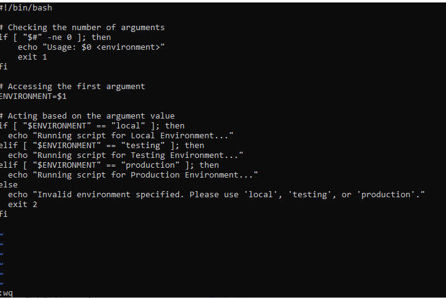
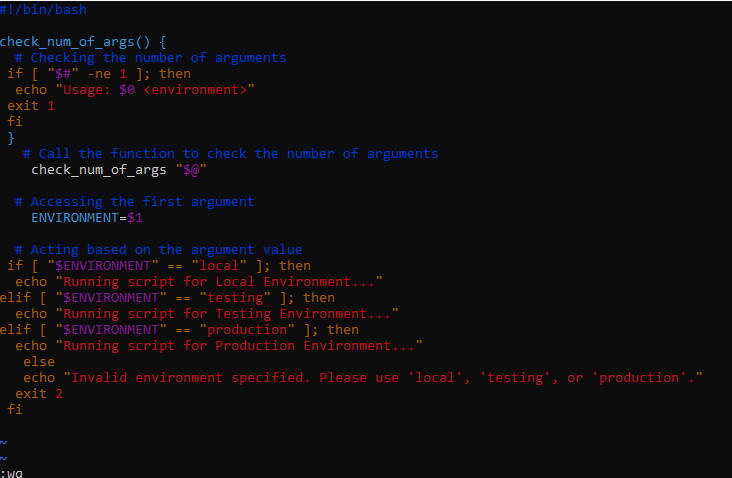
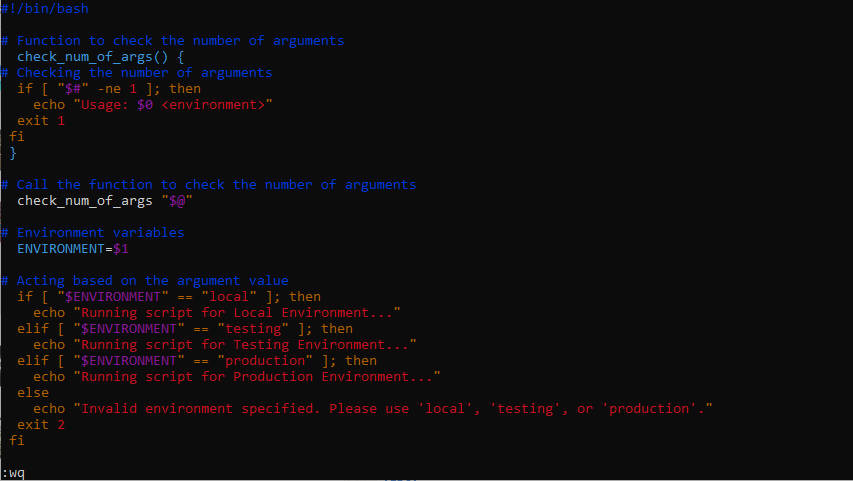
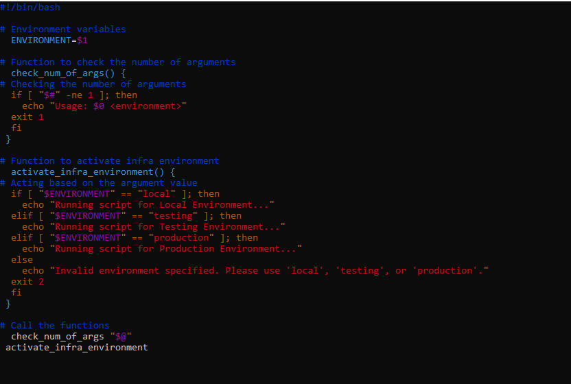
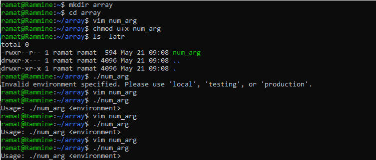
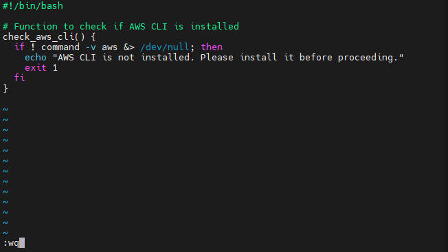
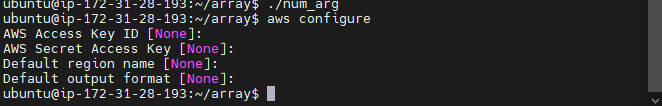
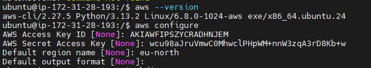

# functions
## Function is used to organised code key and maintain clarity and efficiency.
## When a function is defined in shell script, it remains inactive untill it is invoked or called with the script.

